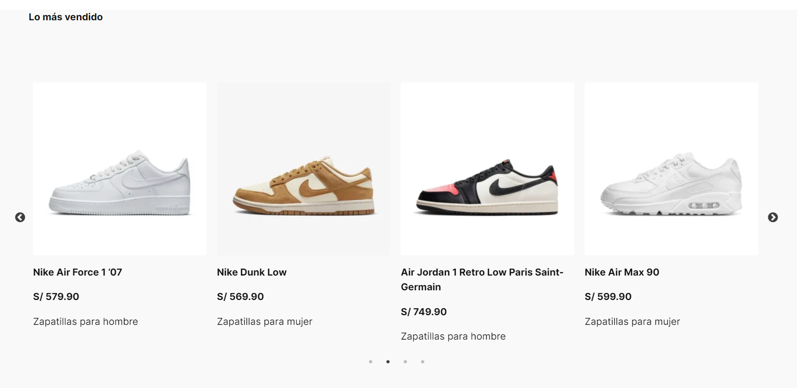
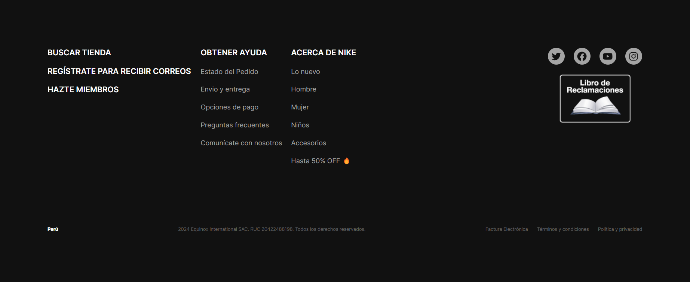
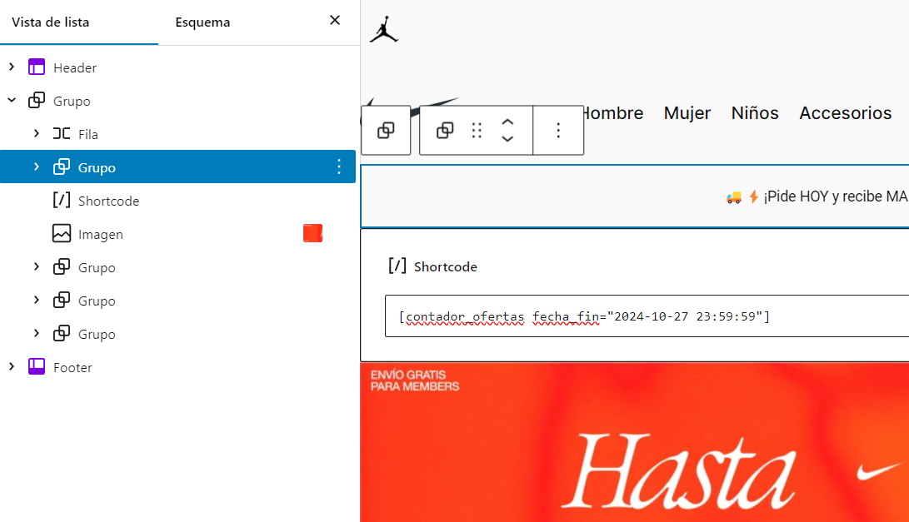
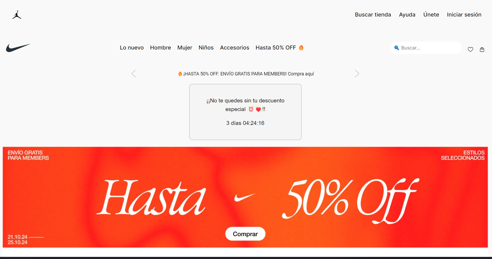

# Prueba técnica Front-End LUDIK

## Maquetado de la Página de [Nike Perú](https://www.nike.com.pe).

### Descripción General

En esta sección se describe el proceso de maquetado de la página de Nike Perú, copiando el mismo diseño así como funcionalidades generales de la misma.

### Problemas Encontrados

- **Interactividad:** Necesidad de implementar elementos interactivos como sliders y carousels para mostrar productos y promociones de manera dinámica.
- **Optimización de Imágenes:** Las imágenes de alta resolución pueden ralentizar el tiempo de carga de la página, afectando la experiencia del usuario y el SEO.
- **Personalización de Estilo:** Necesidad de personalizar el diseño de la página sin modificar directamente los archivos del tema.
- **Compatibilidad de SVG:** Dificultades para integrar iconos en la página.
- **Creación de Contenido Visual:** Requerimiento de una solución sencilla para agregar sliders y carousels sin complicaciones técnicas.

### Lista de Plugins Usados

- **Carousel Slider Block:** Permite agregar fácilmente sliders y carousels a las páginas, proporcionando una interfaz intuitiva para arrastrar y soltar elementos.

- **Image Optimizer:** Optimiza automáticamente las imágenes al subirlas, reduciendo su tamaño sin perder calidad.

- **Simple Custom CSS and JS:** Permite a los usuarios agregar CSS y JavaScript personalizados fácilmente desde el panel de administración de WordPress.

- **Smart Slider 3:** Un plugin para crear sliders avanzados con características como animaciones y capas, así como opciones de personalización extensas.

- **SVG Support:** Habilita la carga de archivos SVG en WordPress, lo que permite utilizar iconos en el contenido de la página.

- **WP Slick Slider and Image Carousel:** Ofrece un slider de imágenes y un carousel que se adapta automáticamente a diferentes tamaños de pantalla.

### Capturas de pantalla:

#### Header de la página así como carrusel para ver ofertas y descuentos en envíos con sus respectivos botones para ver la siguiente imagen o la anterior


#### Imagen de fondo con texto incrustado y botón


#### Carousel con los productos mas vendidos



#### Otra imagen de fondo con texto incrustado y 2 botones


#### Footer de la página



- Con las capturas de pantalla presentadas, se demuestra que la maquetación de la página de Nike Perú fue un éxito. Cada elemento, desde el header con el carrusel de ofertas hasta los fondos con texto incrustado y los botones de navegación, se ha replicado fielmente según los requisitos establecidos. Además, el diseño del footer complementa la estética general de la página, proporcionando una experiencia de usuario coherente y atractiva. Esta implementación no solo refleja la funcionalidad de la página original, sino que también destaca la capacidad para crear un diseño interactivo y visualmente atractivo que cumple con los estándares de la marca.

## Creación del Plugin

Después de realizar la maquetación de la página de Nike Perú, me surgió la idea de desarrollar un plugin que ofreciera un contador para ofertas especiales y descuentos. Este enfoque no solo agregaría funcionalidad a la página, sino que también representaba un reto personal, ya que no había creado un plugin desde cero antes.

Comencé investigando y viendo videos en YouTube para entender mejor el proceso. Localicé la carpeta adecuada dentro de la instalación de WordPress, específicamente en `C:\laragon\www\Nike-Copia\wp-content\plugins`. Allí, creé una nueva carpeta llamada `contador-oferta`, que contendría todos los archivos necesarios para mi plugin.

Una vez establecida la estructura inicial, procedí a implementar la funcionalidad básica del contador. Durante esta fase, me centré en asegurarme de que el plugin funcionara correctamente, aunque sin estilos. Esta etapa fue clave para comprender cómo interactuaban los elementos y cómo debía gestionar las fechas y tiempos para el contador.

Después de validar que el plugin funcionaba adecuadamente, pasé a la parte de estilización. Aquí, pude aplicar mis conocimientos de CSS y mejorar la presentación visual del contador. Este proyecto representó un reto significativo, ya que el manejo de fechas era un área en la que no tenía mucha experiencia previa. Sin embargo, esta dificultad me permitió pulir mis habilidades y aprender más sobre la manipulación de fechas en JavaScript y PHP.

La creación de este plugin no solo cumplió con los requisitos de la prueba técnica, sino que también me proporcionó una valiosa experiencia en el desarrollo de funcionalidades para WordPress y un mejor entendimiento de cómo abordar problemas nuevos.

### Capturas de pantalla:

#### Vista de la lista de plugins con el plugin "Contador de ofertas"

Se puede apreciar que nuestro plugin está en la lista de plugins instalados, además de incluir una pequeña descripción sobre cómo usarlo, la versión y el autor.


#### Uso del shortcode en Gutenberg

En este caso, coloqué la fecha para el 27 de octubre del año 2024, lo que permite que el contador cuente regresivamente hasta esa fecha. Esto es especialmente útil para promociones especiales o descuentos que finalizan en una fecha específica.

El shortcode puede ser fácilmente insertado en cualquier bloque de Gutenberg, brindando flexibilidad a los usuarios para posicionar el contador donde lo deseen.



#### Vista del contador en la página

Se puede apreciar la cuenta regresiva en formato de días, horas, minutos y segundos, mostrando el tiempo restante para que finalicen las ofertas.



### Código del plugin

```php
<?php
/*
Plugin Name: Contador de Ofertas
Description: Muestra un temporizador de cuenta regresiva para las ofertas. Usa el shortcode [contador_ofertas fecha_fin="YYYY-MM-DD HH:MM:SS"] para mostrar el temporizador en tus páginas o publicaciones
Version: 1.0
Author: Solís Martos Alejandro Stéfano
*/

if (! defined('ABSPATH')) {
    exit;
}

function contador_ofertas_shortcode($atts)
{
    $atts = shortcode_atts(
        array(
            'fecha_fin' => '2024-12-31 23:59:59',
        ),
        $atts
    );

    $fecha_fin = strtotime($atts['fecha_fin']);

    $tiempo_actual = time();
    $tiempo_restante = $fecha_fin - $tiempo_actual;

    if ($tiempo_restante > 0) {

        $dias = floor($tiempo_restante / (60 * 60 * 24));
        $horas = floor(($tiempo_restante % (60 * 60 * 24)) / (60 * 60));
        $minutos = floor(($tiempo_restante % (60 * 60)) / 60);
        $segundos = $tiempo_restante % 60;

        ob_start();
?>
        <style>
            #ofertas-contador {
                font-family: Arial, sans-serif;
                background-color: #f5f5f5;
                padding: 20px;
                border: 2px solid #ccc;
                border-radius: 10px;
                text-align: center;
                max-width: 300px;
                margin: 0 auto;
                margin-bottom: 20px;
            }

            #temporizador {
                font-size: 2rem;
                color: #ff6600;
                font-weight: bold;
                transition: color 0.5s;
            }

            .contador-label {
                font-size: 1rem;
                color: #333;
            }
        </style>
        <div id="ofertas-contador">
            <p class="contador-label">¡¡No te quedes sin tu descuento especial ⏰❤️‍🔥!!</p>
            <span id="temporizador"><?php echo "$dias días $horas:$minutos:$segundos "; ?></span>
        </div>
        <script>
            function agregarCero(num) {
                return (num < 10 ? '0' : '') + num;
            }

            function iniciarCuentaRegresiva(duracion) {
                var tiempo = duracion,
                    dias, horas, minutos, segundos;

                setInterval(function() {
                    dias = Math.floor(tiempo / (60 * 60 * 24));
                    horas = Math.floor((tiempo % (60 * 60 * 24)) / (60 * 60));
                    minutos = Math.floor((tiempo % (60 * 60)) / 60);
                    segundos = tiempo % 60;


                    document.getElementById('temporizador').textContent = dias + " días " + agregarCero(horas) + ":" + agregarCero(minutos) + ":" + agregarCero(segundos);


                    if (tiempo <= 86400) {
                        document.getElementById('temporizador').style.color = 'red';
                    }

                    if (--tiempo < 0) {
                        document.getElementById('temporizador').textContent = "¡Oferta terminada!";
                    }
                }, 1000);
            }

            var duracionCuentaRegresiva = <?php echo $tiempo_restante; ?>;
            iniciarCuentaRegresiva(duracionCuentaRegresiva);
        </script>
<?php
        return ob_get_clean();
    } else {
        return '<p>¡La oferta ha terminado!</p>';
    }
}
add_shortcode('contador_ofertas', 'contador_ofertas_shortcode');

```

### Reflexiones Finales

Este proyecto no solo me permitió aplicar mis conocimientos en maquetación y desarrollo de plugins en WordPress, sino que también me brindó la oportunidad de enfrentar y superar desafíos técnicos. La experiencia de replicar la página de Nike Perú y desarrollar un plugin funcional desde cero ha sido enriquecedora, ampliando mi comprensión sobre la interactividad y la optimización en el desarrollo web. Espero que este trabajo demuestre mi capacidad para aprender rápidamente y adaptarme a nuevas tecnologías, así como mi compromiso por ofrecer soluciones efectivas y visualmente atractivas en el ámbito del desarrollo front-end.
